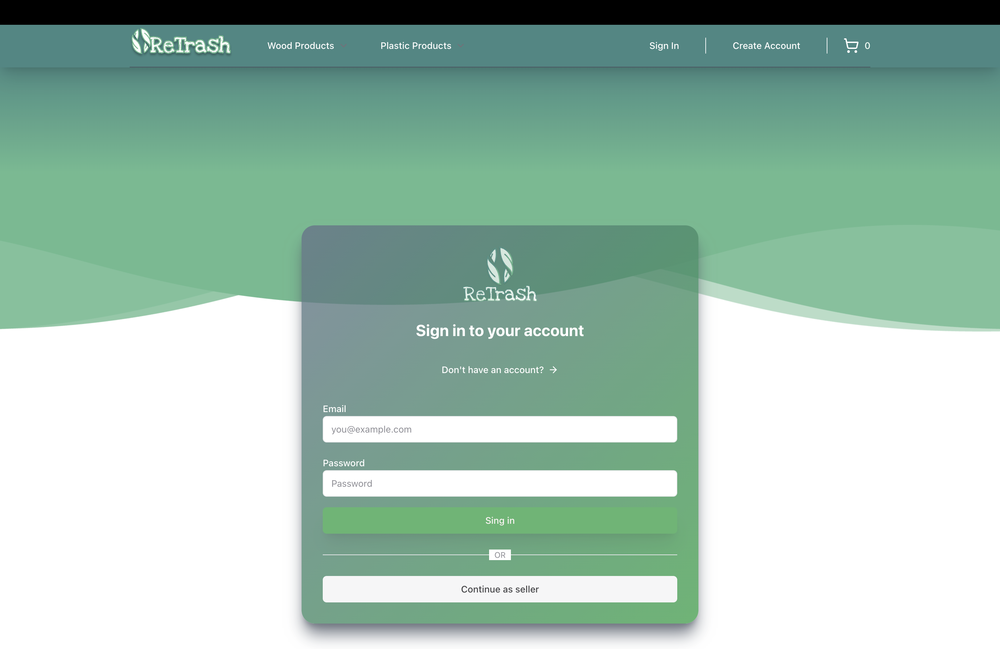

# 🛒 ReTrash Ecommerce App with Next.js & Payload CMS

A fullstack ecommerce web application built with **Next.js 13 (App Router)**, **tRPC**, **Payload CMS**, **TailwindCSS**, and **PostgreSQL**.  
This project demonstrates **authentication**, **dynamic navbar with session state**, **shopping cart**, and **role-based (buyer & seller)** functionality.

---

## 🚀 Tech Stack
- **Frontend**: Next.js 13, React, TailwindCSS, shadcn/ui
- **Backend**: Payload CMS, tRPC
- **Database**: PostgreSQL
- **Authentication**: JWT + Cookies


---

## ✨ Features
- 🔐 User Authentication (Sign up, Sign in, Logout)  
- 🧾 Dynamic Navbar (changes after login)  
- 🛍 Shopping Cart system  
- 👨‍💼 Seller & Customer role switcher  
- 📱 Responsive design  
- ⚡ Fast API integration using **tRPC**  

---

## 📸 Screenshots
Homepage  


Sign In Page  


---

## ⚙️ Installation

Clone the repo:
```bash
git clone https://github.com/arthampc12/webApps-ReTrash.git
cd webApps-ReTrash

