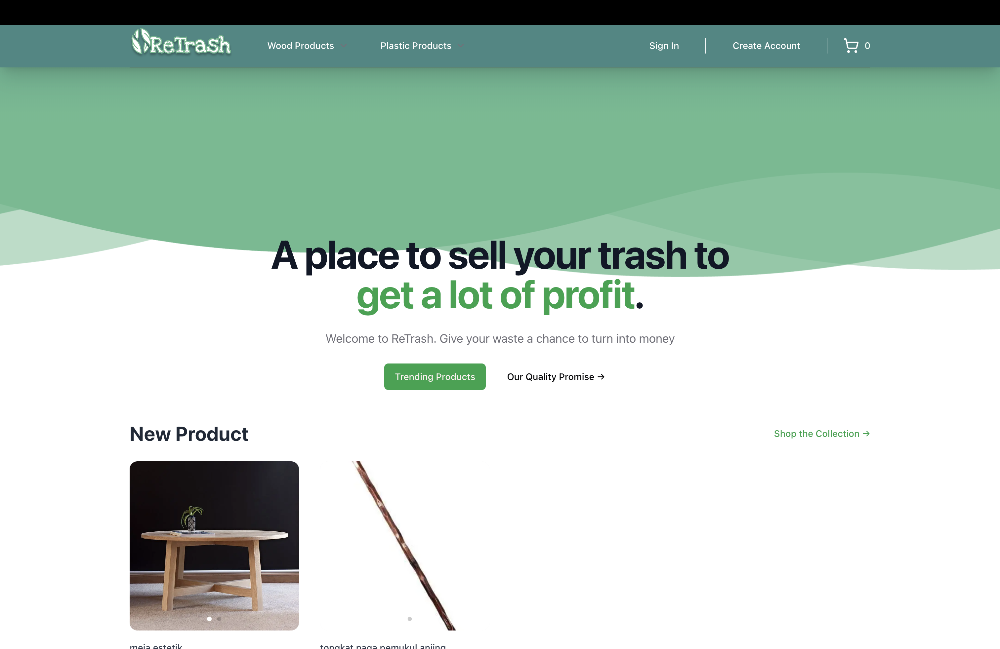
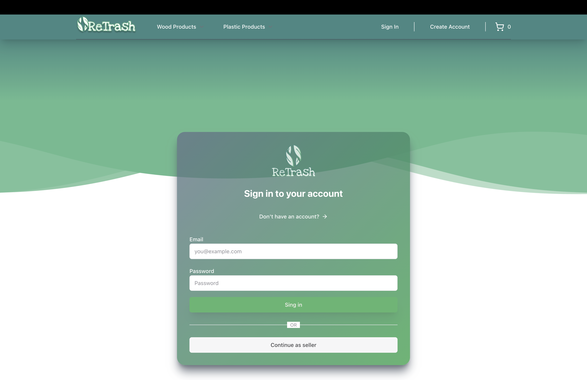

# 🛒 ReTrash Ecommerce App with Next.js & Payload CMS

A fullstack ecommerce web application built with **Next.js 13 (App Router)**, **tRPC**, **Payload CMS**, **TailwindCSS**, and **PostgreSQL**.  
This project demonstrates **authentication**, **dynamic navbar with session state**, **shopping cart**, and **role-based (buyer & seller)** functionality.

---

## 🚀 Tech Stack
- **Frontend**: Next.js 13, React, TailwindCSS, shadcn/ui
- **Backend**: Payload CMS, tRPC
- **Database**: mongoDB
- **Authentication**: JWT + Cookies


---

## ✨ Features
- 🔐 User Authentication (Sign up, Sign in, Logout)  
- 🧾 Dynamic Navbar (changes after login)  
- 🛍 Shopping Cart system  
- 👨‍💼 Seller & Customer role switcher  
- 📱 Responsive design  
- ⚡ Fast API integration using **tRPC**  

---

## 📸 Screenshots
Homepage  


Sign In Page  


---
## ⚙️ Installation

Clone the repo:
```bash
git clone https://github.com/artham12/webApps-ReTrash.git
cd webApps-ReTrash
```
Install dependencies:
```bash
npm install
```
---
## 🔧 Environment Variables (.env setup) 

Create an .env file :
```bash
touch .env
```

Edit the .env file and fill in the respective secrets:
```bash

PAYLOAD_SECRET=your_payload_secret_here
MONGODB_URL=your_mongodb_url_here
NEXT_PUBLIC_SERVER_URL=http://localhost:3000
STRIPE_SECRET_KEY=your_stripe_secret_here
RESEND_API_KEY=your_resend_api_key_here
```
----
🚀 Run Project :
``` bash
npm run dev
```
